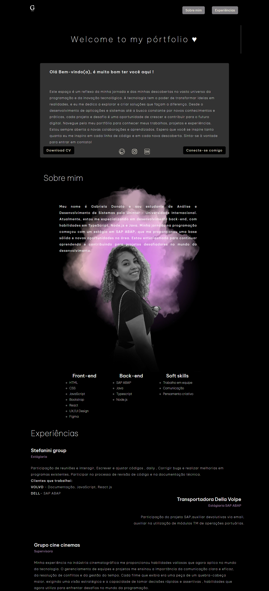

    <h1>Pórtfolio</h1>
    
Bem-vindo ao meu portfólio! Aqui você encontrará meus projetos e conhecimentos em desenvolvimento web.

    

> Este projeto foi desenvolvido com **HTML**, **CSS**, **Bootstrap** e **JavaScript**, refletindo minhas habilidades em criação de interfaces responsivas e interativas. Através dele, aprendi a aplicar conceitos de design e usabilidade, além de aprimorar minha capacidade de resolver problemas de forma criativa. O portfólio é uma vitrine das minhas conquistas e um passo importante na minha jornada profissional.

### Ajustes e melhorias

O projeto ainda está em desenvolvimento, e as próximas atualizações serão voltadas para as seguintes tarefas:

- [ ] Criação do rodapé
- [ ] Desenvolvimento da seção projetos

### Tecnologias Utilizadas

- **HTML5**: Estruturação semântica do conteúdo.
- **CSS3**: Estilização e layout responsivo.
- **Bootstrap**: Framework para design ágil e responsivo.
- **JavaScript**: Interatividade e dinâmica na página.

### Contato

Para mais informações, entre em contato comigo:

- Email: gabriela.donato@email.com
- LinkedIn: [Gabriela Donato](https://www.linkedin.com/in/gabriela-donato)

